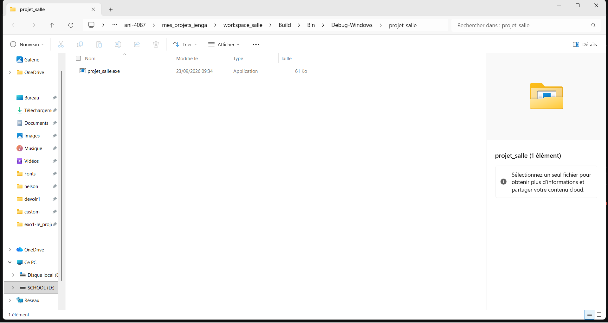
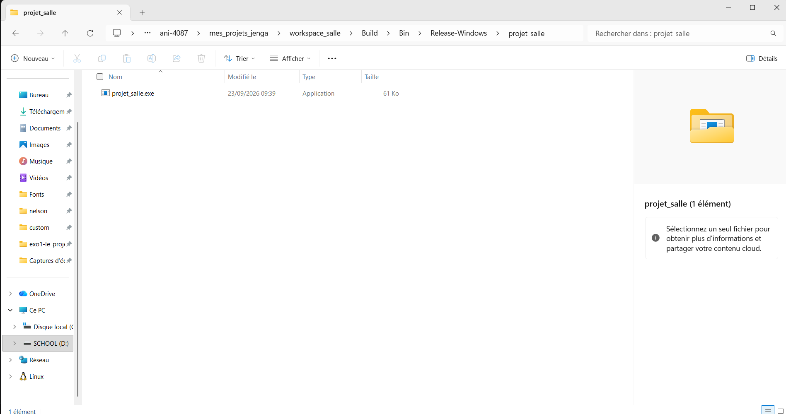

## sortie de "jenga build --config Debug"

temps de construction : 0.81s
taille de l'executable : 61Ko

## sortie de "jenga build --config Release"

temps de construction : 0.91s
taille de l'executable : 61Ko

## extrait du terminal pour Debug:

╔══════════════════════════════════════════════════════════════════╗
║                                                                  ║
║                ██╗███████╗███╗   ██╗ ██████╗  █████╗             ║
║                ██║██╔════╝████╗  ██║██╔════╝ ██╔══██╗            ║
║                ██║█████╗  ██╔██╗ ██║██║  ███╗███████║            ║
║           ██   ██║██╔══╝  ██║╚██╗██║██║   ██║██╔══██║            ║
║           ╚█████╔╝███████╗██║ ╚████║╚██████╔╝██║  ██║            ║
║            ╚════╝ ╚══════╝╚═╝  ╚═══╝ ╚═════╝ ╚═╝  ╚═╝            ║
║                                                                  ║
║             Multi-platform C/C++ Build System v2.8.0             ║
║                                                                  ║
╚══════════════════════════════════════════════════════════════════╝

Loading workspace...

Configuration: Debug
Target:        Windows x86_64
Toolchain:     mingw

Build Order (1 projects):
  1. projet_salle [CONSOLE_APP]

╔══════════════════════════════════════════════════════════════════════════════════════════════╗
║  Project: projet_salle                                                    Kind: CONSOLE_APP  ║
╚══════════════════════════════════════════════════════════════════════════════════════════════╝

ℹ Found 1 source file(s)
✓   [1/1] Compiled: main.cpp
ℹ Linking...
✓ Built: Build\Bin\Debug-Windows\projet_salle\projet_salle.exe

┌──────────────────────────────────────────────────────────────────────────────────────────────┐
│  ✓ Build Successful                                                             Time: 0.81s  │
└──────────────────────────────────────────────────────────────────────────────────────────────┘

════════════════════════════════════════════════════════════════════════════════
                                BUILD COMPLETED                                 
════════════════════════════════════════════════════════════════════════════════
Projects Built:  1/1
Time:           0.81s
Status:         ✓ SUCCESS
════════════════════════════════════════════════════════════════════════════════

## extrait du terminal pour Release

╔══════════════════════════════════════════════════════════════════╗
║                                                                  ║
║                ██╗███████╗███╗   ██╗ ██████╗  █████╗             ║
║                ██║██╔════╝████╗  ██║██╔════╝ ██╔══██╗            ║
║                ██║█████╗  ██╔██╗ ██║██║  ███╗███████║            ║
║           ██   ██║██╔══╝  ██║╚██╗██║██║   ██║██╔══██║            ║
║           ╚█████╔╝███████╗██║ ╚████║╚██████╔╝██║  ██║            ║
║            ╚════╝ ╚══════╝╚═╝  ╚═══╝ ╚═════╝ ╚═╝  ╚═╝            ║
║                                                                  ║
║             Multi-platform C/C++ Build System v2.8.0             ║
║                                                                  ║
╚══════════════════════════════════════════════════════════════════╝

Loading workspace...

Configuration: Release
Target:        Windows x86_64
Toolchain:     mingw

Build Order (1 projects):
  1. projet_salle [CONSOLE_APP]

╔══════════════════════════════════════════════════════════════════════════════════════════════╗
║  Project: projet_salle                                                    Kind: CONSOLE_APP  ║
╚══════════════════════════════════════════════════════════════════════════════════════════════╝

ℹ Found 1 source file(s)
✓   [1/1] Compiled: main.cpp
ℹ Linking...
✓ Built: Build\Bin\Release-Windows\projet_salle\projet_salle.exe

┌──────────────────────────────────────────────────────────────────────────────────────────────┐
│  ✓ Build Successful                                                             Time: 0.91s  │
└──────────────────────────────────────────────────────────────────────────────────────────────┘

════════════════════════════════════════════════════════════════════════════════
                                BUILD COMPLETED
════════════════════════════════════════════════════════════════════════════════
Projects Built:  1/1
Time:           0.91s
Status:         ✓ SUCCESS
════════════════════════════════════════════════════════════════════════════════

Preuve des tailles des fichiers: 

## Comparaison de la taille des 2:
(taille_Debug = 61Ko) = (taille_Release = 61Ko ) 

## Comparaison du temps de construction des 2 :
(c_Debug = 0.81s) < (t_Release = 0.91s )