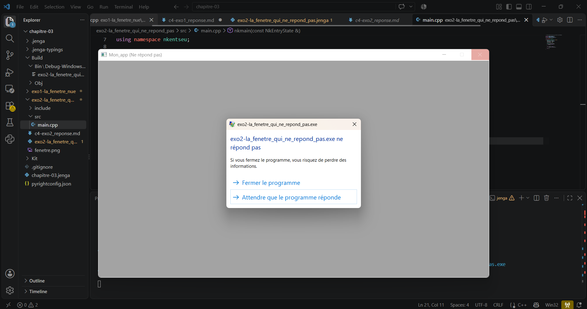

Le système déclare la fenêtre bloquée imédiatement après le lancement de l'execution.


# Exercice : fenêtre bloquée (suppression de PollEvents)

## 1. Modification effectuée

Corps de la boucle principale **avant** :

```cpp
while (fenetre.IsOpen()) {
        NkEvents().PollEvents();
    }
```

Corps de la boucle principale **après** (remplacé par un commentaire) :

```cpp
while (/* condition */) {
    // PollEvents() volontairement supprimé
}
```

## 2. Capture d'écran

Capture prise au moment où le système déclare la fenêtre bloquée :



_Légende : 

> une fenetre s'ouvre indiquant que le programme ne répond pas en nous proposant d'attendre ou de le fermer

---

## 3. Chronométrage

Temps écoulé entre l'apparition de la fenêtre et l'affichage de l'indicateur de blocage.

| Essai | Interaction avec la fenêtre (aucune / clic) | Durée (s) |
|---|---|---|
| 1 | _immédiatement_ | _immédiatement_ |
| 2 | _immédiatementr_ | _immédiatement_ |
| 3 | _immédiatement_ | _immédiatement_ |
| 4 | _immédiatement_ | _immédiatement_ |
| **Moyenne** | | **_immédiatement_** |

**Méthode de mesure :** _ex. chronomètre  sur telephone_

> _je n'ai meme pas eu le temps de lancer le chronomètre, que la fenetre plantait deja._


## 4. Analyse

**Pourquoi le système déclare-t-il la fenêtre bloquée ?**

> cela est dû à l'absence de réponse de l'application. Ça fait partie des règles du contrat avec le système d'exploitation toutes fenêtres non pompées est une fenêtre morte Ce n'est pas un opinion du moteur

