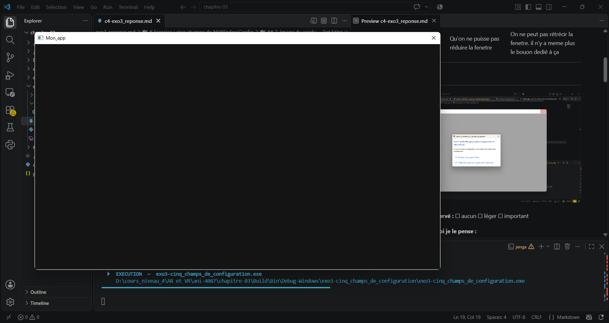

# Exercice : cinq champs de `NkWindowConfig`

## 1. Champs choisis

| N° | Champ | ce que j'attendais | Observation |
|---|---|---|---|
| 1 | config.centered = false; | Que la fenetre ne soit pas centrée |La fenetre n'est pas centrée |
| 2 | config.fullscreen = false; | Que la fenetre ne prenne pas tout l'écran| la fenetre occupe seulement une partie de l'écran |
| 3 | config.movable = false; | que la fenetre soit fixe. on ne peut pa sla déplacer | je ne peux pas déplacer la fanatre |
| 4 | config.maximizable = false; | Qu'on ne puisse pas agrandir la fenetre | On ne peut pas agrandir la fenetre. il n'y a meme plus le bouon dedié à ça |
| 5 |config.minimizable = false;| Qu'on ne puisse pas réduire la fenetre | On ne peut pas rétrécir la fenetre. il n'y a meme plus le bouon dedié à ça  |

---

## 2. Image du rendu

---

## 3. Synthèse

| Champ | Conforme à l'attendu ? |
|---|---|
| config.centered = false;  | oui |
| config.fullscreen = false; | oui |
| config.movable = false; | oui |
| config.maximizable = false; | oui |
| config.minimizable = false; | oui |

---

## 4. Conclusion

> Les noms des champs sont assez intuitifs