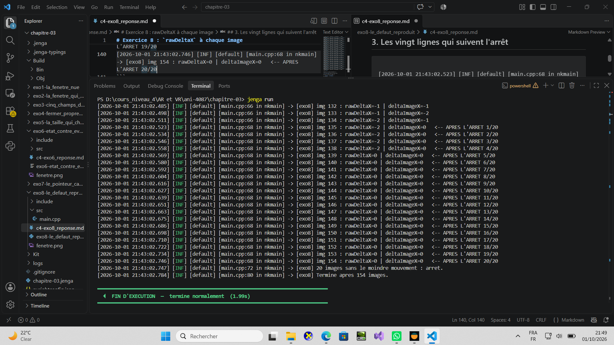

# Exercice 8 : `rawDeltaX` à chaque image

**Nom :** _à compléter_
**Date :** _à compléter_

---

## 1. Code

Le programme affiche `rawDeltaX` à chaque image, sans rien accumuler, filtrer ou remettre à zéro. À côté, et seulement pour comparer, il affiche `MouseDeltaThisFrameX()`, le delta de l'image que `NkInput.NewFrame()` remet à zéro.

Il arme d'abord son compteur (25 images avec mouvement), puis s'arrête seul après 20 images consécutives sans mouvement et marque ces vingt lignes.

```cpp
#include "NKWindow/NKMain.h"
#include "NKWindow/Core/NkWindow.h"
#include "NKWindow/Core/NkWindowConfig.h"
#include "NKEvent/NkWindowEvent.h"
#include "NKEvent/NkKeyboardEvent.h"
#include "NKEvent/NkEventDispatcher.h"   // NkInput
#include "NKTime/NkClock.h"
#include "NKLogger/NkLog.h"

using namespace nkentseu;

static const uint32 IMAGES_APRES_ARRET = 20;   // fin : images immobiles d'affilee
static const uint32 IMAGES_POUR_ARMER = 25;    // debut : images avec mouvement

int nkmain(const NkEntryState &state) {
    (void)state;

    NkWindowConfig cfg;
    cfg.title = "MaFenetre - exo8 - bougez, puis posez la main";
    cfg.width = 1280;
    cfg.height = 720;
    cfg.centered = true;

    NkWindow fenetre(cfg);
    if (!fenetre.IsValid())
        return 1;

    bool tourne = true;
    uint64 images = 0;
    uint32 silence = 0;             // images consecutives sans mouvement
    uint32 actives = 0;             // images avec mouvement, depuis le debut
    bool arme = false;              // vrai quand la souris a vraiment bouge

    NkEventSystem &evenements = NkEvents();
    evenements.AddEventCallback<NkWindowCloseEvent>([&](NkWindowCloseEvent *) { tourne = false; });
    evenements.AddEventCallback<NkKeyPressEvent>([&](NkKeyPressEvent *e) {
        if (e->GetKey() == NkKey::NK_ESCAPE) tourne = false;
    });

    logger.Info("[exo8] Cliquez dans la fenetre, BOUGEZ la souris, puis POSEZ LA MAIN.");
    logger.Info("[exo8] Le compteur s'arme apres {0} images de mouvement, puis l'arret est detecte apres {1} images immobiles.",
                IMAGES_POUR_ARMER, IMAGES_APRES_ARRET);

    while (tourne) {
        NkInput.NewFrame();
        evenements.PollEvents();
        ++images;

        const int32 rawX = NkInput.MouseRawDeltaX();        // ce que l'exercice demande
        const int32 imageX = NkInput.MouseDeltaThisFrameX(); // pour comparer

        const bool immobile = (imageX == 0) && (NkInput.MouseDeltaThisFrameY() == 0);

        if (!immobile) {
            ++actives;
            silence = 0;
            if (!arme && actives >= IMAGES_POUR_ARMER) {
                arme = true;
                logger.Info("[exo8] --- mouvement confirme : la surveillance de l'arret commence ---");
            }
        } else if (arme) {
            ++silence;
        }

        if (silence == 0)
            logger.Info("[exo8] img {0} : rawDeltaX={1} | deltaImageX={2}", images, rawX, imageX);
        else
            logger.Info("[exo8] img {0} : rawDeltaX={1} | deltaImageX={2}   <-- APRES L'ARRET {3}/{4}",
                        images, rawX, imageX, silence, IMAGES_APRES_ARRET);

        if (arme && silence >= IMAGES_APRES_ARRET) {
            logger.Info("[exo8] {0} images sans le moindre mouvement : arret.", IMAGES_APRES_ARRET);
            tourne = false;
        }

        NkClock::Sleep((int64)10);
    }

    fenetre.Close();
    logger.Info("[exo8] Termine apres {0} images.", images);
    return 0;
}
```

**Notes sur le code :**

> - `rawX` vient de `MouseRawDeltaX()` et n'est jamais modifié par le programme : c'est exactement la valeur de la bibliothèque qui est affichée.
> - `imageX` (`MouseDeltaThisFrameX()`) sert uniquement de point de comparaison, et sert aussi à détecter l'immobilité.
> - Les 20 lignes demandées sont celles marquées `<-- APRES L'ARRET n/20`.

---

## 2. Protocole suivi

1. Lancer le programme.
2. Cliquer dans la fenêtre.
3. Bouger franchement la souris pendant deux ou trois secondes (le compteur s'arme après 25 images de mouvement).
4. Poser la main et ne plus toucher à rien.
5. Le programme s'arrête seul après 20 images immobiles.


## 3. Les vingt lignes qui suivent l'arrêt

```text

[2026-10-01 21:43:02.523] [INF] [default] [main.cpp:68 in nkmain] -> [exo8] img 135 : rawDeltaX=-2 | deltaImageX=0   <-- APRES L'ARRET 1/20
[2026-10-01 21:43:02.534] [INF] [default] [main.cpp:68 in nkmain] -> [exo8] img 136 : rawDeltaX=-2 | deltaImageX=0   <-- APRES L'ARRET 2/20
[2026-10-01 21:43:02.546] [INF] [default] [main.cpp:68 in nkmain] -> [exo8] img 137 : rawDeltaX=-2 | deltaImageX=0   <-- APRES L'ARRET 3/20
[2026-10-01 21:43:02.558] [INF] [default] [main.cpp:68 in nkmain] -> [exo8] img 138 : rawDeltaX=-2 | deltaImageX=0   <-- APRES L'ARRET 4/20
[2026-10-01 21:43:02.569] [INF] [default] [main.cpp:68 in nkmain] -> [exo8] img 139 : rawDeltaX=0 | deltaImageX=0   <-- APRES L'ARRET 5/20
[2026-10-01 21:43:02.580] [INF] [default] [main.cpp:68 in nkmain] -> [exo8] img 140 : rawDeltaX=0 | deltaImageX=0   <-- APRES L'ARRET 6/20
[2026-10-01 21:43:02.592] [INF] [default] [main.cpp:68 in nkmain] -> [exo8] img 141 : rawDeltaX=0 | deltaImageX=0   <-- APRES L'ARRET 7/20
[2026-10-01 21:43:02.604] [INF] [default] [main.cpp:68 in nkmain] -> [exo8] img 142 : rawDeltaX=0 | deltaImageX=0   <-- APRES L'ARRET 8/20
[2026-10-01 21:43:02.616] [INF] [default] [main.cpp:68 in nkmain] -> [exo8] img 143 : rawDeltaX=0 | deltaImageX=0   <-- APRES L'ARRET 9/20
[2026-10-01 21:43:02.627] [INF] [default] [main.cpp:68 in nkmain] -> [exo8] img 144 : rawDeltaX=0 | deltaImageX=0   <-- APRES L'ARRET 10/20
[2026-10-01 21:43:02.639] [INF] [default] [main.cpp:68 in nkmain] -> [exo8] img 145 : rawDeltaX=0 | deltaImageX=0   <-- APRES L'ARRET 11/20
[2026-10-01 21:43:02.651] [INF] [default] [main.cpp:68 in nkmain] -> [exo8] img 146 : rawDeltaX=0 | deltaImageX=0   <-- APRES L'ARRET 12/20
[2026-10-01 21:43:02.663] [INF] [default] [main.cpp:68 in nkmain] -> [exo8] img 147 : rawDeltaX=0 | deltaImageX=0   <-- APRES L'ARRET 13/20
[2026-10-01 21:43:02.675] [INF] [default] [main.cpp:68 in nkmain] -> [exo8] img 148 : rawDeltaX=0 | deltaImageX=0   <-- APRES L'ARRET 14/20
[2026-10-01 21:43:02.686] [INF] [default] [main.cpp:68 in nkmain] -> [exo8] img 149 : rawDeltaX=0 | deltaImageX=0   <-- APRES L'ARRET 15/20
[2026-10-01 21:43:02.698] [INF] [default] [main.cpp:68 in nkmain] -> [exo8] img 150 : rawDeltaX=0 | deltaImageX=0   <-- APRES L'ARRET 16/20
[2026-10-01 21:43:02.710] [INF] [default] [main.cpp:68 in nkmain] -> [exo8] img 151 : rawDeltaX=0 | deltaImageX=0   <-- APRES L'ARRET 17/20
[2026-10-01 21:43:02.722] [INF] [default] [main.cpp:68 in nkmain] -> [exo8] img 152 : rawDeltaX=0 | deltaImageX=0   <-- APRES L'ARRET 18/20
[2026-10-01 21:43:02.734] [INF] [default] [main.cpp:68 in nkmain] -> [exo8] img 153 : rawDeltaX=0 | deltaImageX=0   <-- APRES L'ARRET 19/20
[2026-10-01 21:43:02.746] [INF] [default] [main.cpp:68 in nkmain] -> [exo8] img 154 : rawDeltaX=0 | deltaImageX=0   <-- APRES L'ARRET 20/20
```

**Capture de la console  :**



**Ce que je lis dans ces lignes :**

| | `rawDeltaX` | `deltaImageX` |
|---|---|---|
| Première ligne après l'arrêt | -2 | 0 |
| Dernière ligne après l'arrêt (20/20) | 0 | 0 |
| Valeur change-t-elle pendant les 20 lignes ? | Oui | Non |

---

## 4. Ce que ces lignes prouvent (en une phrase)


**Pistes pour la formuler (à valider avec vos propres lignes) :**

`rawDeltaX` ne reste pas figé sur une valeur non nulle pendant que `deltaImageX` vaut 0 : la valeur brute est remise à zéro d'une image à l'autre. La valeur qu'il faut plus considérer est celle de RawdeltaX parce qu'elle analyse le mouvement jusqu'au bout meme si la souris est déjà lachée

## 5. Conclusion

> il faut utiliser la valeur de delta ImageX pour savoir si la souris bouge réellement dans l'image courante.